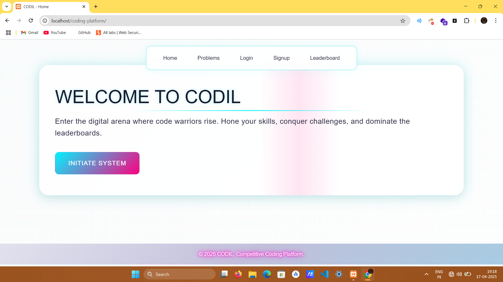
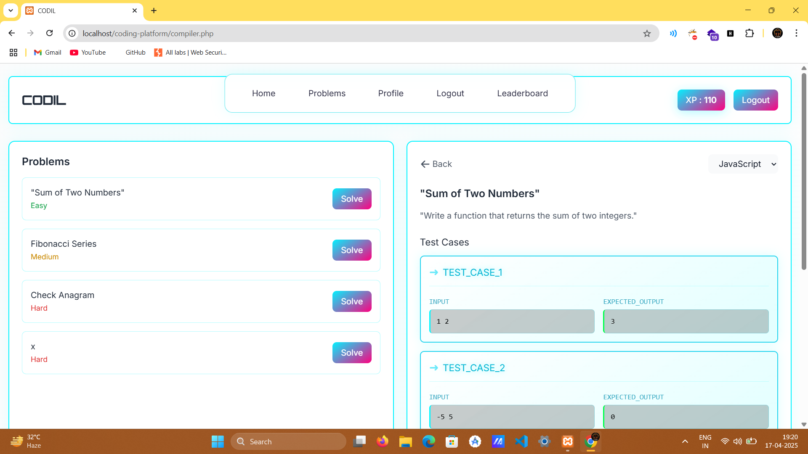
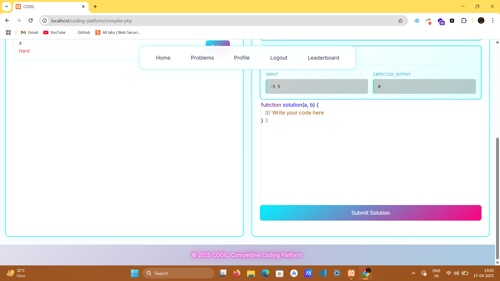
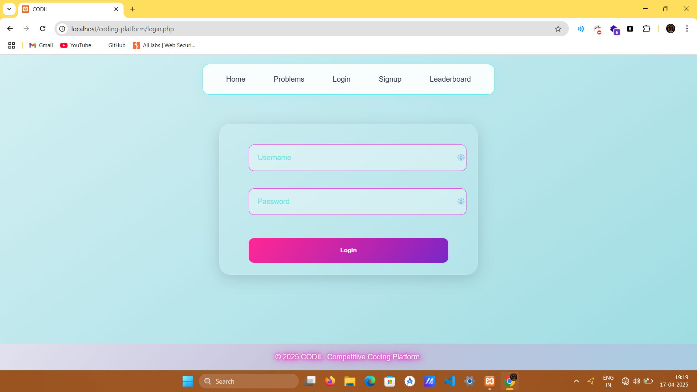
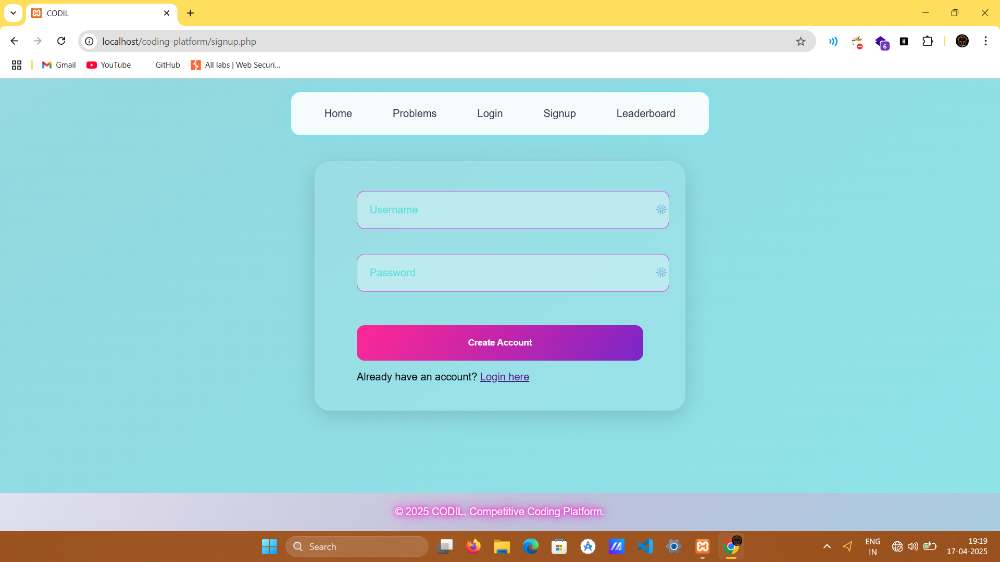
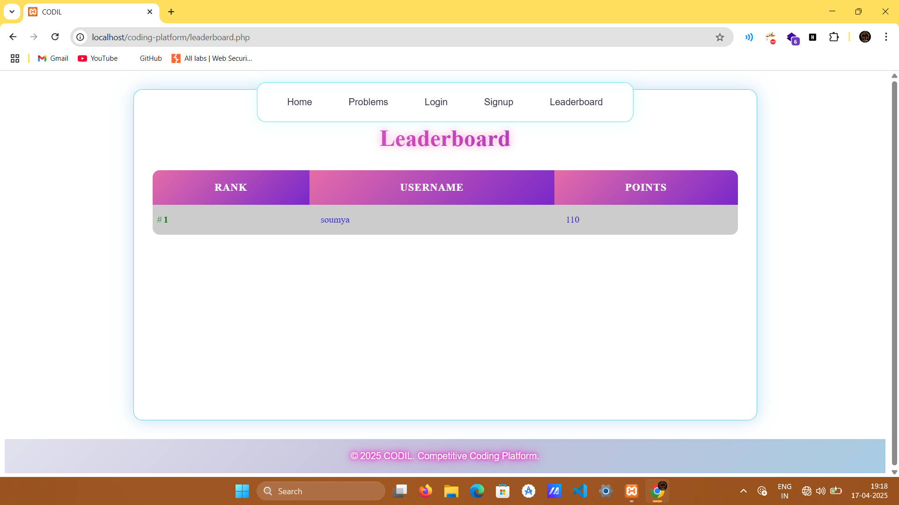
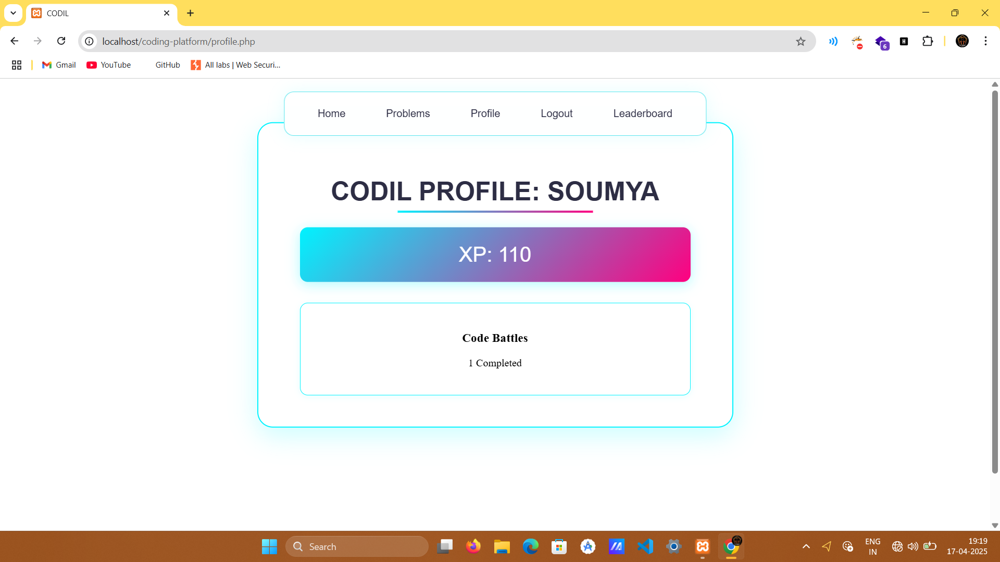
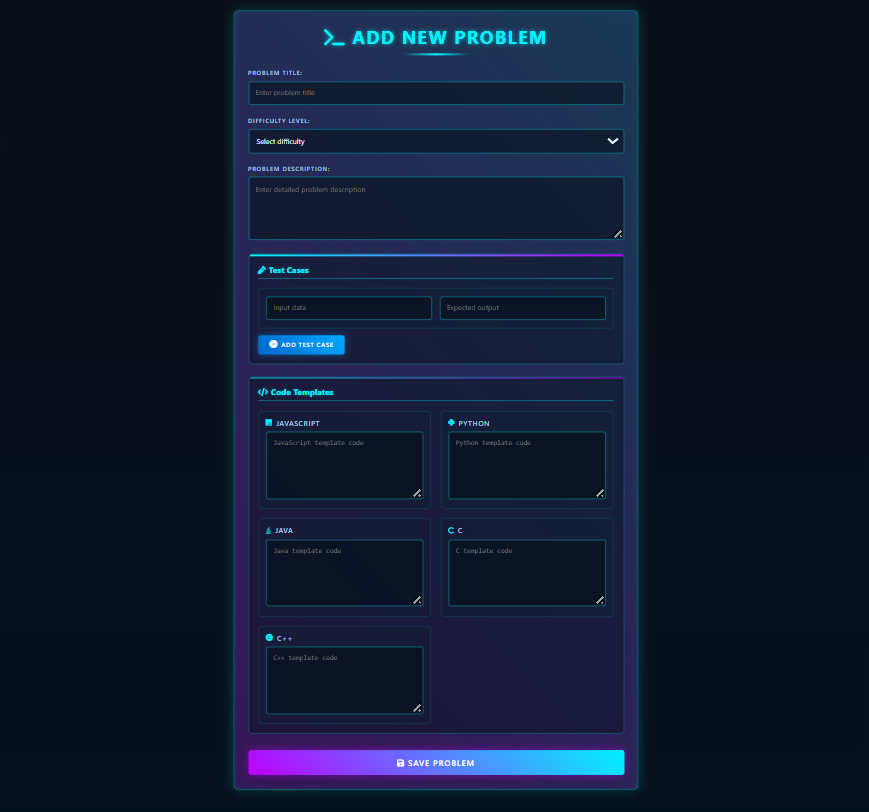

# competitive-coding-platform

# 🧠 Competitive Coding Platform

A web-based platform that allows users to solve coding problems in real time, submit code in multiple languages, and receive instant feedback based on predefined test cases. Designed for coders, students, and educators to practice and evaluate programming skills.

---

## 🚀 Features

- 💻 Online code editor with support for multiple languages (Python, C, C++, Java, JavaScript)
- ✅ Automatic evaluation of submitted code against multiple test cases
- 🧪 Test case management using MySQL database
- 📊 Submission result feedback (pass/fail, output mismatch)
- 🧰 Admin panel to add coding problems 
- 🗃️ Clean UI for users to browse and solve problems

---

## 🛠️ Tech Stack

| Category        | Tech Used                      |
|----------------|--------------------------------|
| Frontend       | HTML, CSS, JavaScript          |
| Backend        | PHP / Python |
| Database       | MySQL                          |
| Compiler API   | [Judge0](https://judge0.com/) / it have daily limit of 50 uploads due to free api|
| Hosting        | XAMPP / Localhost (dev)        |

---

## 📸 Screenshots

### 🧑 User Interface

#### 🏠 Home Page


#### 💻 Code Editor



#### ✅ Login and SignUp



#### LeaderBoard


#### ProfilePage

---

### 🛠️ Admin Panel

#### 📋 Problem Management



> 📁 Placed screenshots in a `/screenshots` folder inside the repo.

---
📫 Contact
If you have any questions, suggestions, or want to collaborate on projects, feel free to reach out:

📧 Email: sahoosoumyaranjan074@gmail.com

---
## 🧑‍💻 How to Run Locally

1. Clone the repository:

```bash
git clone https://github.com/SOUMYA074/competitive-coding-platform.git
